## 📋 目录

1. [项目概述](https://claude.ai/chat/69710180-be91-4dbb-aa13-cc1ec896f8e8#%E9%A1%B9%E7%9B%AE%E6%A6%82%E8%BF%B0)
2. [技术栈选型](https://claude.ai/chat/69710180-be91-4dbb-aa13-cc1ec896f8e8#%E6%8A%80%E6%9C%AF%E6%A0%88%E9%80%89%E5%9E%8B)
3. [系统架构设计](https://claude.ai/chat/69710180-be91-4dbb-aa13-cc1ec896f8e8#%E7%B3%BB%E7%BB%9F%E6%9E%B6%E6%9E%84%E8%AE%BE%E8%AE%A1)
4. [核心模块设计](https://claude.ai/chat/69710180-be91-4dbb-aa13-cc1ec896f8e8#%E6%A0%B8%E5%BF%83%E6%A8%A1%E5%9D%97%E8%AE%BE%E8%AE%A1)
5. [性能优化策略](https://claude.ai/chat/69710180-be91-4dbb-aa13-cc1ec896f8e8#%E6%80%A7%E8%83%BD%E4%BC%98%E5%8C%96%E7%AD%96%E7%95%A5)
6. [数据库设计](https://claude.ai/chat/69710180-be91-4dbb-aa13-cc1ec896f8e8#%E6%95%B0%E6%8D%AE%E5%BA%93%E8%AE%BE%E8%AE%A1)
7. [前端界面设计](https://claude.ai/chat/69710180-be91-4dbb-aa13-cc1ec896f8e8#%E5%89%8D%E7%AB%AF%E7%95%8C%E9%9D%A2%E8%AE%BE%E8%AE%A1)
8. [AI 集成方案](https://claude.ai/chat/69710180-be91-4dbb-aa13-cc1ec896f8e8#ai-%E9%9B%86%E6%88%90%E6%96%B9%E6%A1%88)
9. [下载引擎设计](https://claude.ai/chat/69710180-be91-4dbb-aa13-cc1ec896f8e8#%E4%B8%8B%E8%BD%BD%E5%BC%95%E6%93%8E%E8%AE%BE%E8%AE%A1)
10. [刮削引擎设计](https://claude.ai/chat/69710180-be91-4dbb-aa13-cc1ec896f8e8#%E5%88%AE%E5%89%8A%E5%BC%95%E6%93%8E%E8%AE%BE%E8%AE%A1)
11. [开发路线图](https://claude.ai/chat/69710180-be91-4dbb-aa13-cc1ec896f8e8#%E5%BC%80%E5%8F%91%E8%B7%AF%E7%BA%BF%E5%9B%BE)

---

## 项目概述

### 核心定位

JAVManager 是一款基于 **Tauri 2.0 + Rust + Vue 3** 构建的高性能本地视频媒体管理系统，专注于提供：

- **极致性能**：处理数万视频文件时保持流畅体验
- **智能化**：AI 驱动的文件名识别和内容分析
- **自动化**：从扫描、识别、刮削到下载的全流程自动化
- **现代化**：使用最新技术栈，提供美观的用户界面

### 核心特性

|特性|描述|
|---|---|
|🚀 高性能扫描|异步并发扫描，1000 个文件 < 2s|
|🤖 AI 智能识别|多模型支持，准确识别乱码文件名|
|📦 自动刮削|多源抓取，自动下载封面和元数据|
|⬇️ 智能下载|多线程下载，自动重试和版本检测|
|🎨 虚拟滚动|流畅展示数万视频，CPU 占用 < 10%|
|🔄 热更新|实时监控文件夹，自动处理新文件|

---

## 技术栈选型

### 架构分层

```
┌─────────────────────────────────────────────┐
│           前端层 (Presentation)              │
│  Vue 3 + Shadcn/ui + TailwindCSS + Pinia   │
└─────────────────────────────────────────────┘
                      ↕ IPC
┌─────────────────────────────────────────────┐
│            应用层 (Application)              │
│          Tauri 2.0 (Rust Core)              │
└─────────────────────────────────────────────┘
                      ↕
┌─────────────────────────────────────────────┐
│             业务层 (Business)                │
│  扫描器 | AI引擎 | 刮削器 | 下载器 | 缓存   │
└─────────────────────────────────────────────┘
                      ↕
┌─────────────────────────────────────────────┐
│             数据层 (Data)                    │
│     SQLite + SQLx + 文件系统 + 外部工具     │
└─────────────────────────────────────────────┘
```

### 前端技术栈

|技术|版本|用途|
|---|---|---|
|Vue|3.4+|核心框架，Composition API|
|Shadcn/ui|Latest|现代化组件库 (基于 Radix)|
|TailwindCSS|3.4+|原子化 CSS，零运行时开销|
|Pinia|2.1+|状态管理|
|@tanstack/vue-virtual|3.0+|虚拟滚动，解决大列表性能|
|VueUse|10+|组合式工具库|

### 后端技术栈

|技术|版本|用途|
|---|---|---|
|Tauri|2.0+|桌面应用框架|
|Rust|1.75+|核心语言|
|Tokio|1.35+|异步运行时|
|SQLx|0.7+|类型安全的 SQL 库|
|Reqwest|0.11+|HTTP 客户端|
|Scraper|0.18+|HTML 解析|
|Notify|6.1+|文件系统监控|
|Image|0.24+|图像处理|
|Moka|0.12+|高性能内存缓存|

### 外部工具

|工具|用途|
|---|---|
|FFmpeg|视频处理、截图提取|
|N_m3u8DL-RE|M3U8 下载器|

---

## 系统架构设计

### 总体架构图

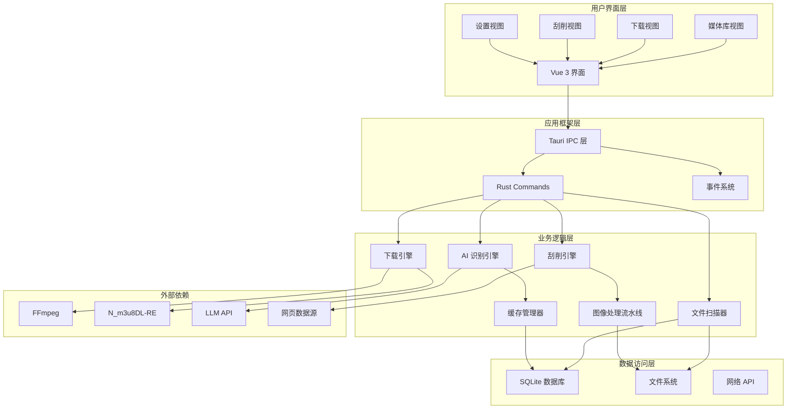

### 数据流架构

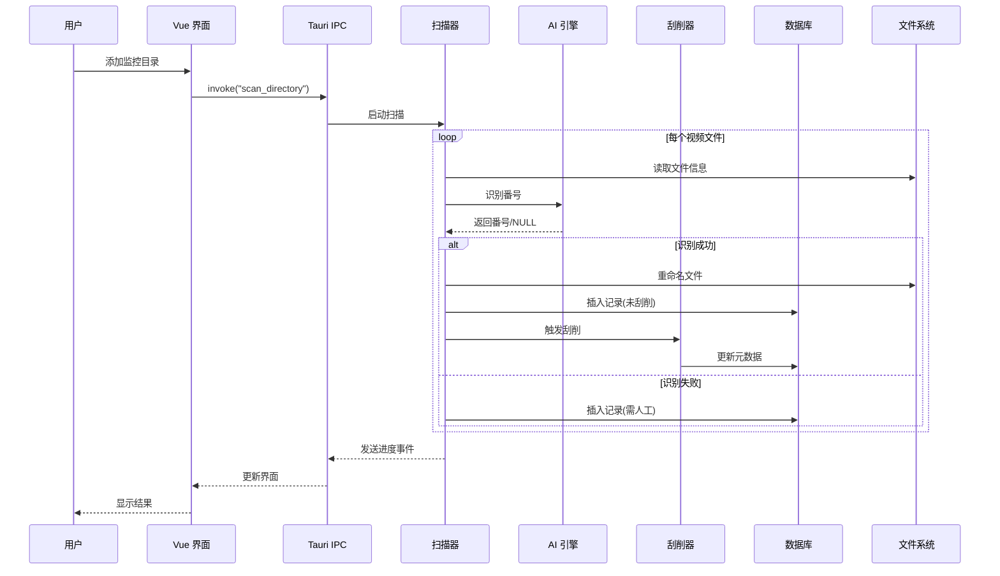

### Actor 模型并发架构

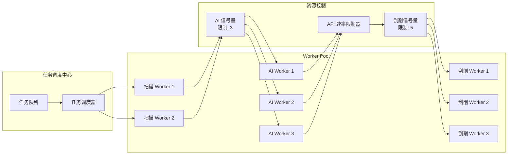

**并发控制逻辑示例：**

```rust
// 使用信号量控制并发数
static SCRAPE_SEMAPHORE: Lazy<Semaphore> = Lazy::new(|| Semaphore::new(5));
static AI_SEMAPHORE: Lazy<Semaphore> = Lazy::new(|| Semaphore::new(3));

async fn process_video(path: PathBuf) -> Result<()> {
    // 1. 获取 AI 识别许可
    let _ai_permit = AI_SEMAPHORE.acquire().await?;
    let designation = identify_with_ai(&path).await?;
    drop(_ai_permit); // 立即释放
    
    // 2. 获取刮削许可
    let _scrape_permit = SCRAPE_SEMAPHORE.acquire().await?;
    let metadata = scrape_metadata(&designation).await?;
    drop(_scrape_permit);
    
    // 3. 保存到数据库
    save_to_db(metadata).await?;
    
    Ok(())
}
```

---

## 核心模块设计

### 模块关系图

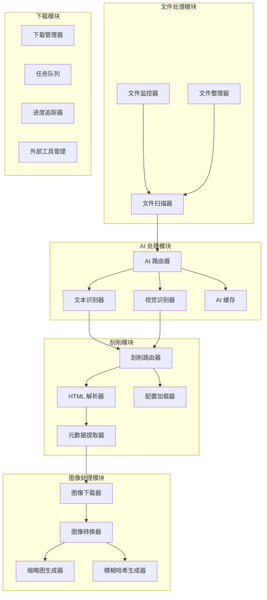

### 1. 文件扫描模块

**职责：** 递归扫描目录，识别视频文件，提取基本信息

**核心流程：**

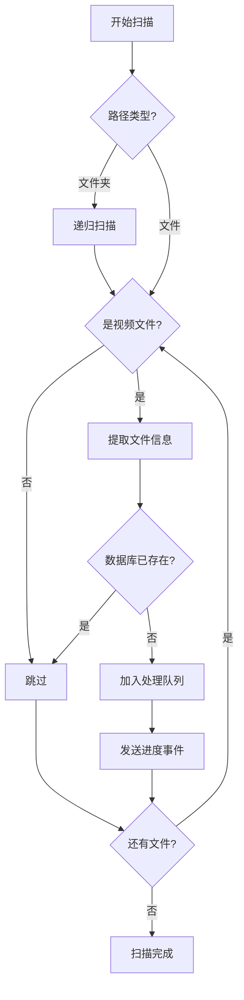

**实现要点：**

```rust
// 文件扫描器核心结构
struct FileScanner {
    // 支持的视频扩展名
    extensions: HashSet<String>,
    // 排除的目录模式
    exclude_patterns: Vec<Regex>,
    // 并发扫描数
    concurrent_limit: usize,
}

// 扫描结果
struct ScanResult {
    path: PathBuf,
    filename: String,
    size: u64,
    modified: SystemTime,
    hash: Option<String>, // 可选的文件哈希
}

// 扫描进度事件
struct ScanProgress {
    total: usize,
    processed: usize,
    current_file: String,
    status: ScanStatus,
}
```

### 2. AI 识别引擎

**职责：** 从杂乱的文件名中提取番号，支持多种 AI 模型

**策略模式架构：**

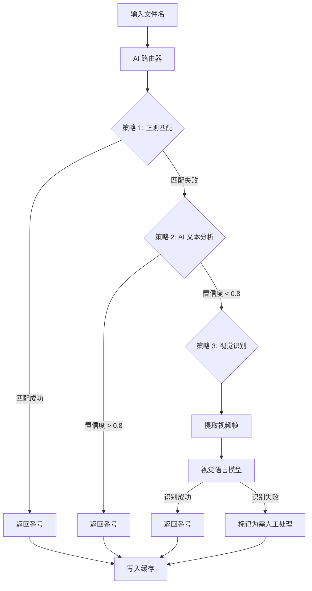

**多模型配置：**

```rust
// AI 配置结构
struct AIConfig {
    id: String,
    provider: AIProvider, // OpenAI, DeepSeek, Claude 等
    api_key: String,
    endpoint: String,
    model: String,
    priority: u8,        // 优先级
    active: bool,        // 是否启用
    rate_limit: u32,     // 请求频率限制
}

// AI 识别结果
struct IdentificationResult {
    designation: Option<String>,
    confidence: f32,
    source: String,      // 识别来源
    fallback_used: bool, // 是否使用了备用模型
}
```

**Prompt 工程示例：**

```json
{
  "system": "你是一个专业的视频文件整理助手。你的任务是从混乱的文件名中提取 JAV 番号。",
  "user_template": "从以下文件名中提取番号，只返回番号本身，如果无法识别返回 'UNKNOWN'：\n文件名: {filename}\n\n规则：\n1. 番号格式通常为 ABC-123 或 ABCD-123\n2. 忽略分辨率标记如 [4K]、[FHD]\n3. 忽略发布组名称\n4. 如果有多个可能，选择最标准的格式",
  "few_shot_examples": [
    {
      "input": "[4K]IPX-001_完整版_高清.mp4",
      "output": "IPX-001"
    },
    {
      "input": "SSIS-123 极品美女.mp4",
      "output": "SSIS-123"
    }
  ]
}
```

### 3. 刮削引擎

**职责：** 从多个数据源抓取元数据

**声明式配置架构：**

```json
{
  "scrapers": [
    {
      "id": "javbus",
      "name": "JavBus",
      "priority": 1,
      "base_url": "https://www.javbus.com/{designation}",
      "selectors": {
        "title": {
          "type": "css",
          "selector": "h3",
          "extract": "text"
        },
        "cover": {
          "type": "css",
          "selector": ".bigImage img",
          "extract": "attr:src"
        },
        "studio": {
          "type": "css",
          "selector": "span:contains('製作商:') + span a",
          "extract": "text"
        },
        "release_date": {
          "type": "css",
          "selector": "span:contains('發行日期:') + span",
          "extract": "text",
          "parser": "date:YYYY-MM-DD"
        },
        "tags": {
          "type": "css",
          "selector": ".genre label a",
          "extract": "text",
          "multiple": true
        }
      },
      "requires_proxy": true,
      "cloudflare_protection": true
    },
    {
      "id": "javdb",
      "name": "JavDB",
      "priority": 2,
      "base_url": "https://javdb.com/search?q={designation}",
      "selectors": {
        "title": {
          "type": "xpath",
          "selector": "//h2[@class='title']/text()",
          "extract": "text"
        }
      }
    }
  ]
}
```

**刮削流程：**

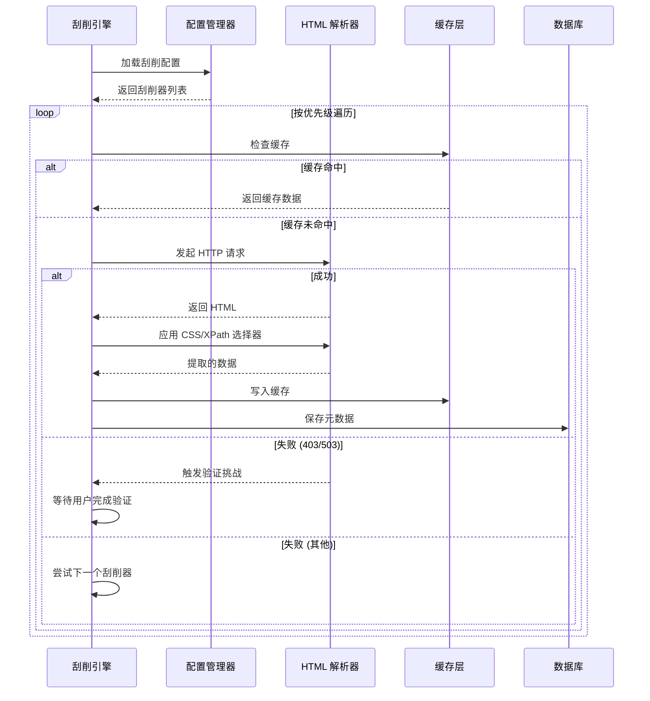

### 5. 下载引擎

**职责：** 管理视频下载任务

**任务状态机：**

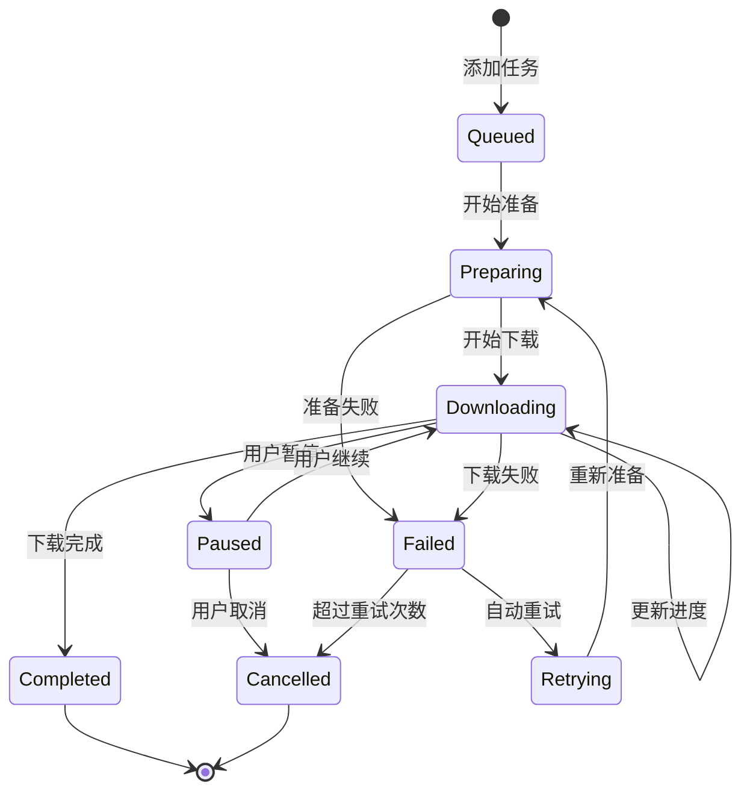

**下载器策略：**

```rust
// 下载器配置
enum DownloaderType {
    NM3u8DLRE,    // 主力 M3U8 下载器
    FFmpeg,        // 备用，直接转码
}

struct DownloadTask {
    id: Uuid,
    url: String,
    save_path: PathBuf,
    status: TaskStatus,
    progress: f32,
    speed: u64,           // bytes/s
    downloaded: u64,
    total: u64,
    downloader: DownloaderType,
    retry_count: u32,
    created_at: DateTime<Utc>,
    started_at: Option<DateTime<Utc>>,
    completed_at: Option<DateTime<Utc>>,
}
```

---

## 性能优化策略

### 1. 零拷贝设计

**原则：** 尽可能使用引用和借用，避免不必要的内存分配

```rust
// ❌ 不好的做法：多次克隆
fn process_filename_bad(filename: String) -> String {
    let temp = filename.clone();
    let result = temp.to_uppercase();
    result.clone()
}

// ✅ 好的做法：使用引用
fn process_filename_good(filename: &str) -> Cow<'_, str> {
    if filename.chars().all(|c| c.is_uppercase()) {
        // 已经是大写，直接借用
        Cow::Borrowed(filename)
    } else {
        // 需要转换，才分配新内存
        Cow::Owned(filename.to_uppercase())
    }
}
```

### 2. 多级缓存策略

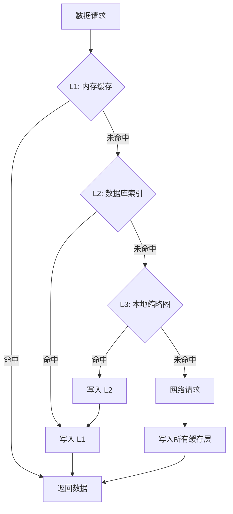

**缓存配置：**

```rust
// L1: 内存缓存配置
struct MemoryCacheConfig {
    max_capacity: u64,      // 最大容量 (bytes)
    time_to_live: Duration, // 过期时间
    time_to_idle: Duration, // 空闲过期时间
}

// 使用 moka 库的高性能缓存
use moka::future::Cache;

lazy_static! {
    static ref METADATA_CACHE: Cache<String, VideoMetadata> = 
        Cache::builder()
            .max_capacity(10_000)
            .time_to_live(Duration::from_secs(3600))
            .build();
}
```

### 3. 背压控制

**目标：** 防止系统过载，保持稳定性能

```rust
// 背压控制器
struct BackpressureController {
    // AI 识别信号量
    ai_semaphore: Arc<Semaphore>,
    // 刮削信号量
    scrape_semaphore: Arc<Semaphore>,
    // 下载信号量
    download_semaphore: Arc<Semaphore>,
    // 图像处理信号量
    image_semaphore: Arc<Semaphore>,
    // 速率限制器
    rate_limiter: Arc<RateLimiter>,
}

impl BackpressureController {
    fn new(config: &AppConfig) -> Self {
        Self {
            ai_semaphore: Arc::new(Semaphore::new(config.ai_concurrent)),
            scrape_semaphore: Arc::new(Semaphore::new(config.scrape_concurrent)),
            download_semaphore: Arc::new(Semaphore::new(config.download_concurrent)),
            image_semaphore: Arc::new(Semaphore::new(config.image_concurrent)),
            rate_limiter: Arc::new(RateLimiter::new(config.api_rate_limit)),
        }
    }
}
```

### 4. 数据库优化

**索引策略：**

```sql
-- 关键索引
CREATE INDEX idx_designation ON videos(designation);
CREATE INDEX idx_studio ON videos(studio_id);
CREATE INDEX idx_release_date ON videos(release_date);
CREATE INDEX idx_rating ON videos(rating);
CREATE INDEX idx_scan_status ON videos(scan_status);

-- 复合索引（常见查询组合）
CREATE INDEX idx_studio_rating ON videos(studio_id, rating DESC);
CREATE INDEX idx_status_date ON videos(scan_status, created_at DESC);
```

**WAL 模式提升并发：**

```sql
-- 开启 WAL 模式
PRAGMA journal_mode = WAL;

-- 优化设置
PRAGMA synchronous = NORMAL;
PRAGMA cache_size = -64000;  -- 64MB
PRAGMA temp_store = MEMORY;
PRAGMA mmap_size = 30000000000;  -- 30GB
```

### 5. 性能基准测试

**测试目标：**

|测试项|目标|测量方式|
|---|---|---|
|文件扫描速度|1000 文件 < 2s|计时扫描完成时间|
|AI 识别速度|单文件 < 500ms|单次 API 调用时间|
|刮削速度|单视频 < 2s|包含图片下载的总时间|
|界面渲染|60 FPS|Chrome DevTools FPS 计数器|
|内存占用|10000 视频 < 500MB|任务管理器监控|
|CPU 占用|滚动时 < 10%|任务管理器监控|

---

## 数据库设计

### ER 图

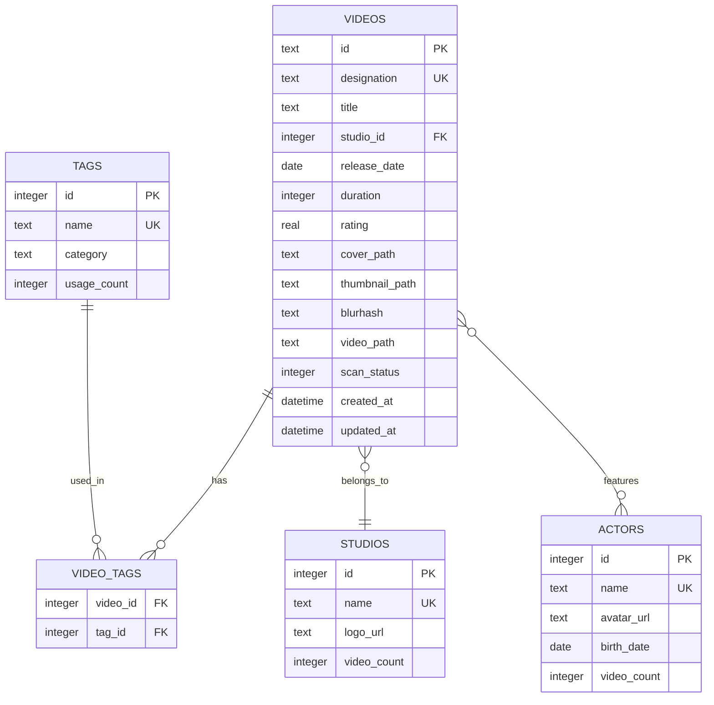

### 核心表结构

**videos 表：**

```sql
CREATE TABLE videos (
    -- 主键和唯一标识
    id TEXT PRIMARY KEY DEFAULT (lower(hex(randomblob(16)))),
    designation TEXT UNIQUE NOT NULL,  -- 番号
    
    -- 基本信息
    title TEXT NOT NULL,
    studio_id INTEGER REFERENCES studios(id),
    release_date DATE,
    duration INTEGER,  -- 秒
    rating REAL DEFAULT 0 CHECK(rating >= 0 AND rating <= 5),
    
    -- 文件路径
    video_path TEXT NOT NULL,
    cover_path TEXT,           -- 封面图本地路径
    thumbnail_path TEXT,       -- 缩略图路径
    blurhash TEXT,             -- 模糊哈希占位符
    
    -- 状态标记
    scan_status INTEGER DEFAULT 0 CHECK(scan_status IN (0,1,2,3,4)),
    -- 0: 待识别, 1: 未刮削, 2: 已完成, 3: 识别失败, 4: 刮削失败
    
    -- 元数据
    file_size INTEGER,         -- 文件大小 (bytes)
    file_hash TEXT,            -- 文件哈希 (可选)
    ai_confidence REAL,        -- AI 识别置信度
    
    -- 时间戳
    created_at DATETIME DEFAULT CURRENT_TIMESTAMP,
    updated_at DATETIME DEFAULT CURRENT_TIMESTAMP,
    scraped_at DATETIME
);

-- 触发器：自动更新 updated_at
CREATE TRIGGER update_videos_timestamp 
AFTER UPDATE ON videos
FOR EACH ROW
BEGIN
    UPDATE videos SET updated_at = CURRENT_TIMESTAMP WHERE id = NEW.id;
END;
```

**studios 表：**

```sql
CREATE TABLE studios (
    id INTEGER PRIMARY KEY AUTOINCREMENT,
    name TEXT UNIQUE NOT NULL,
    name_en TEXT,              -- 英文名
    logo_url TEXT,
    website TEXT,
    video_count INTEGER DEFAULT 0,
    created_at DATETIME DEFAULT CURRENT_TIMESTAMP
);
```

**tags 表：**

```sql
CREATE TABLE tags (
    id INTEGER PRIMARY KEY AUTOINCREMENT,
    name TEXT UNIQUE NOT NULL,
    category TEXT,             -- 分类：genre, series, feature 等
    usage_count INTEGER DEFAULT 0,
    created_at DATETIME DEFAULT CURRENT_TIMESTAMP
);
```

**video_tags 关联表：**

```sql
CREATE TABLE video_tags (
    video_id TEXT REFERENCES videos(id) ON DELETE CASCADE,
    tag_id INTEGER REFERENCES tags(id) ON DELETE CASCADE,
    PRIMARY KEY (video_id, tag_id)
);
```

**actors 表：**

```sql
CREATE TABLE actors (
    id INTEGER PRIMARY KEY AUTOINCREMENT,
    name TEXT UNIQUE NOT NULL,
    name_en TEXT,
    avatar_url TEXT,
    birth_date DATE,
    video_count INTEGER DEFAULT 0,
    created_at DATETIME DEFAULT CURRENT_TIMESTAMP
);

CREATE TABLE video_actors (
    video_id TEXT REFERENCES videos(id) ON DELETE CASCADE,
    actor_id INTEGER REFERENCES actors(id) ON DELETE CASCADE,
    PRIMARY KEY (video_id, actor_id)
);
```

### 全文搜索

```sql
-- 使用 FTS5 实现全文搜索
CREATE VIRTUAL TABLE videos_fts USING fts5(
    designation,
    title,
    tags,
    content=videos,
    content_rowid=rowid
);

-- 触发器：同步更新 FTS 索引
CREATE TRIGGER videos_fts_insert AFTER INSERT ON videos
BEGIN
    INSERT INTO videos_fts(rowid, designation, title, tags)
    VALUES (NEW.rowid, NEW.designation, NEW.title, 
            (SELECT group_concat(t.name, ' ') FROM tags t
             JOIN video_tags vt ON t.id = vt.tag_id
             WHERE vt.video_id = NEW.id));
END;
```

---

## 前端界面设计

### 界面结构

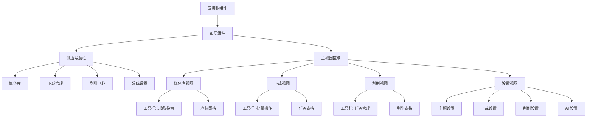

### 1. 媒体库视图

**布局示意：**

```
┌─────────────────────────────────────────────────────────────┐
│  🏠 媒体库                                      ⚙️ 设置       │
├─────────────────────────────────────────────────────────────┤
│  🔍 搜索框          📁 片商 ▼  🏷️ 标签 ▼  ⭐ 评分 ▼       │
│  共 12,345 个视频                                           │
├─────────────────────────────────────────────────────────────┤
│  ┌─────┐  ┌─────┐  ┌─────┐  ┌─────┐  ┌─────┐  ┌─────┐     │
│  │     │  │     │  │     │  │     │  │     │  │     │     │
│  │封面1│  │封面2│  │封面3│  │封面4│  │封面5│  │封面6│     │
│  │     │  │     │  │     │  │     │  │     │  │     │     │
│  └─────┘  └─────┘  └─────┘  └─────┘  └─────┘  └─────┘     │
│  ABC-001  ABC-002  ABC-003  ABC-004  ABC-005  ABC-006      │
│  ⭐ 4.5   ⭐ 4.2   ⭐ 4.8   ⭐ 3.9   ⭐ 4.1   ⭐ 4.6       │
│                                                              │
│  ┌─────┐  ┌─────┐  ┌─────┐  ┌─────┐  ┌─────┐  ┌─────┐     │
│  │     │  │     │  │     │  │     │  │     │  │     │     │
│  │封面7│  │封面8│  │封面9│  │封面10│ │封面11│ │封面12│    │
│  ...                                                         │
└─────────────────────────────────────────────────────────────┘
```

**虚拟滚动实现：**

```vue
<script setup lang="ts">
import { useVirtualizer } from '@tanstack/vue-virtual'
import { useVideoStore } from '@/stores/video'
import { computed, ref } from 'vue'

const videoStore = useVideoStore()
const scrollContainer = ref<HTMLElement>()

// 过滤后的视频列表
const filteredVideos = computed(() => videoStore.filteredVideos)

// 虚拟滚动配置
const rowVirtualizer = useVirtualizer({
  count: filteredVideos.value.length,
  getScrollElement: () => scrollContainer.value,
  estimateSize: () => 320, // 每个卡片高度
  overscan: 10, // 预渲染额外的项
  lanes: 6, // 每行 6 列（响应式调整）
})

// 响应式列数
const columns = computed(() => {
  const width = window.innerWidth
  if (width < 640) return 2
  if (width < 1024) return 4
  if (width < 1536) return 6
  return 8
})
</script>

<template>
  <div ref="scrollContainer" class="h-full overflow-auto">
    <div 
      :style="{ 
        height: `${rowVirtualizer.getTotalSize()}px`,
        position: 'relative' 
      }"
    >
      <div
        v-for="virtualRow in rowVirtualizer.getVirtualItems()"
        :key="virtualRow.index"
        :style="{
          position: 'absolute',
          top: 0,
          left: 0,
          width: '100%',
          height: `${virtualRow.size}px`,
          transform: `translateY(${virtualRow.start}px)`
        }"
      >
        <VideoCard 
          v-for="col in columns"
          :key="virtualRow.index * columns + col"
          :video="filteredVideos[virtualRow.index * columns + col]"
          :loading="'lazy'"
        />
      </div>
    </div>
  </div>
</template>
```

**VideoCard 组件：**

```vue
<script setup lang="ts">
import { computed } from 'vue'
import { useIntersectionObserver } from '@vueuse/core'

interface Props {
  video: Video
  loading?: 'lazy' | 'eager'
}

const props = defineProps<Props>()

// 懒加载图片
const imageRef = ref<HTMLImageElement>()
const isVisible = ref(false)

useIntersectionObserver(
  imageRef,
  ([{ isIntersecting }]) => {
    if (isIntersecting) isVisible.value = true
  },
  { rootMargin: '200px' } // 提前 200px 开始加载
)

// 图片源（使用 BlurHash 占位符）
const imageSrc = computed(() => {
  if (!isVisible.value && props.loading === 'lazy') {
    return props.video.blurhash // BlurHash 占位符
  }
  return props.video.thumbnail_path || props.video.cover_path
})
</script>

<template>
  <div class="video-card group relative overflow-hidden rounded-lg shadow-md hover:shadow-xl transition-shadow">
    <!-- 封面图 -->
    <div class="aspect-[2/3] overflow-hidden bg-gray-200">
      
    </div>
    
    <!-- 悬浮信息 -->
    <div class="absolute inset-0 bg-gradient-to-t from-black/80 to-transparent opacity-0 group-hover:opacity-100 transition-opacity">
      <div class="absolute bottom-0 p-4 text-white">
        <h3 class="font-semibold text-sm truncate">{{ video.title }}</h3>
        <p class="text-xs text-gray-300">{{ video.designation }}</p>
        <div class="flex items-center gap-2 mt-2">
          <span class="text-yellow-400">⭐ {{ video.rating }}</span>
          <span class="text-xs">{{ video.duration }}min</span>
        </div>
      </div>
    </div>
    
    <!-- 状态徽章 -->
    <div v-if="video.scan_status !== 2" class="absolute top-2 right-2">
      <span class="badge" :class="statusClass">
        {{ statusText }}
      </span>
    </div>
  </div>
</template>
```

### 2. 下载视图

**表格布局：**

```
┌─────────────────────────────────────────────────────────────┐
│  ⬇️ 下载管理                                                │
├─────────────────────────────────────────────────────────────┤
│  ▶️ 开始  ⏸️ 暂停  🗑️ 删除  🔄 重试  📁 打开文件夹         │
├─────────────────────────────────────────────────────────────┤
│  名称             │ 状态    │ 速度      │ 进度         │ 操作│
├─────────────────────────────────────────────────────────────┤
│  ABC-001.mp4      │ 下载中  │ 5.2 MB/s  │ ████░░ 65%  │ ... │
│  ABC-002.mp4      │ 暂停    │ -         │ ███░░░ 45%  │ ... │
│  ABC-003.mp4      │ 完成    │ -         │ ██████ 100% │ ... │
│  ABC-004.mp4      │ 等待中  │ -         │ ░░░░░░ 0%   │ ... │
│  ABC-005.mp4      │ 失败    │ -         │ ██░░░░ 30%  │ ... │
└─────────────────────────────────────────────────────────────┘
```

**实时进度更新：**

```vue
<script setup lang="ts">
import { useDownloadStore } from '@/stores/download'
import { listen } from '@tauri-apps/api/event'
import { onMounted, onUnmounted } from 'vue'

const downloadStore = useDownloadStore()

// 监听下载进度事件
let unlistenProgress: (() => void) | null = null

onMounted(async () => {
  unlistenProgress = await listen<DownloadProgress>(
    'download-progress',
    (event) => {
      downloadStore.updateProgress(event.payload)
    }
  )
})

onUnmounted(() => {
  unlistenProgress?.()
})

// 右键菜单
const contextMenuItems = [
  { label: '打开文件', action: 'open-file' },
  { label: '打开目录', action: 'open-folder' },
  { label: '重新下载', action: 'retry' },
  { label: '删除任务', action: 'delete', danger: true },
]
</script>

<template>
  <Table>
    <TableHeader>
      <TableRow>
        <TableHead>名称</TableHead>
        <TableHead>状态</TableHead>
        <TableHead>速度</TableHead>
        <TableHead>进度</TableHead>
        <TableHead class="text-right">操作</TableHead>
      </TableRow>
    </TableHeader>
    <TableBody>
      <TableRow
        v-for="task in downloadStore.tasks"
        :key="task.id"
        @contextmenu.prevent="showContextMenu($event, task)"
      >
        <TableCell>{{ task.filename }}</TableCell>
        <TableCell>
          <Badge :variant="getStatusVariant(task.status)">
            {{ task.status }}
          </Badge>
        </TableCell>
        <TableCell>{{ formatSpeed(task.speed) }}</TableCell>
        <TableCell>
          <div class="flex items-center gap-2">
            <Progress :value="task.progress" class="w-32" />
            <span class="text-xs text-muted-foreground">
              {{ task.progress.toFixed(1) }}%
            </span>
          </div>
        </TableCell>
        <TableCell class="text-right">
          <DropdownMenu>
            <!-- 操作菜单 -->
          </DropdownMenu>
        </TableCell>
      </TableRow>
    </TableBody>
  </Table>
</template>
```

### 3. 刮削视图

**任务流程展示：**

```
┌─────────────────────────────────────────────────────────────┐
│  🔍 刮削中心                                                 │
├─────────────────────────────────────────────────────────────┤
│  ➕ 新建任务  🔄 同步所有  ▶️ 开始  ⏹️ 停止                │
│  总进度: 8,234 / 12,345 (66.7%)  ⏱️ 预计剩余: 2h 15m      │
├─────────────────────────────────────────────────────────────┤
│  路径                        │ 数量  │ 进度       │ 状态   │
├─────────────────────────────────────────────────────────────┤
│  D:\Videos\2024             │ 1,245 │ ████░ 85%  │ 进行中 │
│  D:\Videos\2023             │ 3,456 │ ██████ 100%│ 完成   │
│  D:\Downloads               │  234  │ ██░░░ 35%  │ 进行中 │
│  E:\Archive                 │ 7,410 │ ░░░░░ 0%   │ 等待中 │
└─────────────────────────────────────────────────────────────┘

  详细日志：
  [14:23:45] ✓ ABC-001 刮削成功 (JavBus)
  [14:23:46] ✓ ABC-002 刮削成功 (JavDB)
  [14:23:47] ⚠ ABC-003 AI 识别失败，标记为人工处理
  [14:23:48] ✓ ABC-004 刮削成功 (JavBus)
```

### 4. 设置视图

**模块化配置：**

```vue
<template>
  <Tabs default-value="theme">
    <TabsList>
      <TabsTrigger value="theme">外观</TabsTrigger>
      <TabsTrigger value="download">下载</TabsTrigger>
      <TabsTrigger value="scrape">刮削</TabsTrigger>
      <TabsTrigger value="ai">AI</TabsTrigger>
    </TabsList>
    
    <TabsContent value="theme">
      <Card>
        <CardHeader>
          <CardTitle>外观设置</CardTitle>
        </CardHeader>
        <CardContent class="space-y-4">
          <div class="flex items-center justify-between">
            <Label>主题</Label>
            <Select v-model="settings.theme">
              <SelectTrigger class="w-32">
                <SelectValue />
              </SelectTrigger>
              <SelectContent>
                <SelectItem value="light">浅色</SelectItem>
                <SelectItem value="dark">深色</SelectItem>
                <SelectItem value="system">跟随系统</SelectItem>
              </SelectContent>
            </Select>
          </div>
          
          <div class="flex items-center justify-between">
            <Label>语言</Label>
            <Select v-model="settings.language">
              <SelectContent>
                <SelectItem value="zh-CN">简体中文</SelectItem>
                <SelectItem value="zh-TW">繁體中文</SelectItem>
                <SelectItem value="en">English</SelectItem>
                <SelectItem value="ja">日本語</SelectItem>
              </SelectContent>
            </Select>
          </div>
        </CardContent>
      </Card>
    </TabsContent>
    
    <TabsContent value="ai">
      <Card>
        <CardHeader>
          <CardTitle>AI 配置</CardTitle>
          <CardDescription>
            配置多个 AI 提供商，系统会自动切换以提高成功率
          </CardDescription>
        </CardHeader>
        <CardContent>
          <div v-for="(provider, index) in aiProviders" :key="index">
            <div class="border rounded-lg p-4 mb-4">
              <div class="flex items-center justify-between mb-2">
                <Switch v-model="provider.active" />
                <Badge>优先级 {{ provider.priority }}</Badge>
              </div>
              
              <div class="grid grid-cols-2 gap-4">
                <div>
                  <Label>提供商</Label>
                  <Select v-model="provider.provider">
                    <SelectContent>
                      <SelectItem value="openai">OpenAI</SelectItem>
                      <SelectItem value="deepseek">DeepSeek</SelectItem>
                      <SelectItem value="claude">Claude</SelectItem>
                    </SelectContent>
                  </Select>
                </div>
                
                <div>
                  <Label>模型</Label>
                  <Input v-model="provider.model" placeholder="gpt-4o-mini" />
                </div>
                
                <div class="col-span-2">
                  <Label>API Key</Label>
                  <Input 
                    v-model="provider.api_key" 
                    type="password"
                    placeholder="sk-..." 
                  />
                </div>
                
                <div>
                  <Label>速率限制 (请求/分钟)</Label>
                  <Input 
                    v-model.number="provider.rate_limit" 
                    type="number"
                  />
                </div>
              </div>
            </div>
          </div>
          
          <Button @click="addProvider" variant="outline" class="w-full">
            ➕ 添加提供商
          </Button>
        </CardContent>
      </Card>
    </TabsContent>
  </Tabs>
</template>
```

---

## AI 集成方案

### AI 识别流程

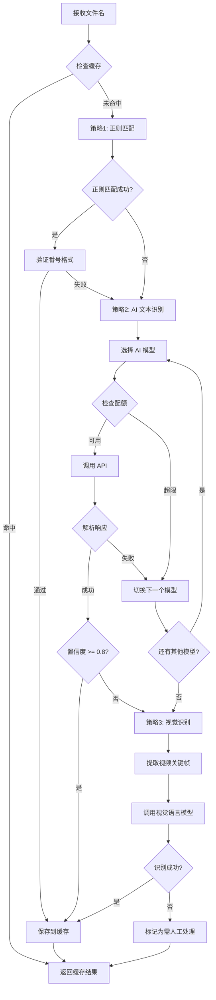

### Prompt 工程

**文本识别 Prompt：**

```json
{
  "system": "你是一个专业的 JAV 视频文件名解析器。你需要从杂乱的文件名中准确提取番号。",
  "rules": [
    "番号格式通常为: [字母]-[数字] 或 [字母][数字]",
    "常见前缀: IPX, SSIS, STARS, MIDV, CAWD, ABP, MKMP 等",
    "忽略以下内容: 分辨率标记([4K], [FHD]), 发布组名, 中文描述, 特殊符号",
    "如果有多个可能的番号,选择最标准的格式",
    "如果完全无法识别,返回 'UNKNOWN'"
  ],
  "output_format": {
    "designation": "string | 'UNKNOWN'",
    "confidence": "float (0-1)",
    "reasoning": "string (可选,说明识别思路)"
  },
  "examples": [
    {
      "input": "[4K]IPX-001_完整版_高清.mp4",
      "output": {
        "designation": "IPX-001",
        "confidence": 0.95,
        "reasoning": "标准格式,前缀 IPX 是常见片商"
      }
    },
    {
      "input": "SSIS-123 极品美女 中文字幕.mp4",
      "output": {
        "designation": "SSIS-123",
        "confidence": 0.98
      }
    },
    {
      "input": "完全看不出是什么.avi",
      "output": {
        "designation": "UNKNOWN",
        "confidence": 0.0,
        "reasoning": "文件名不包含任何番号特征"
      }
    }
  ]
}
```

**视觉识别 Prompt：**

```json
{
  "system": "你是一个视觉内容分析专家。你需要从视频截图中识别番号信息。",
  "task": "分析提供的视频截图,识别其中可能出现的番号文字或特征",
  "focus_areas": [
    "片头字幕中的番号",
    "画面角落的水印",
    "封面上的文字",
    "视频开始/结束时的信息"
  ],
  "output_format": {
    "designation": "string | 'UNKNOWN'",
    "confidence": "float",
    "location": "string (在哪个位置发现的)",
    "frames_analyzed": "array (分析了哪几帧)"
  },
  "instructions": [
    "如果多帧出现相同番号,提高置信度",
    "如果番号格式不标准,标注出来",
    "如果完全没有找到,诚实返回 UNKNOWN"
  ]
}
```

### 多模型容错策略

```rust
// AI 提供商配置
struct AIProvider {
    id: String,
    provider_type: ProviderType,
    api_key: String,
    endpoint: String,
    model: String,
    priority: u8,
    active: bool,
    rate_limit: RateLimit,
    timeout: Duration,
}

// AI 路由器
struct AIRouter {
    providers: Vec<AIProvider>,
    rate_limiters: HashMap<String, RateLimiter>,
}

impl AIRouter {
    async fn identify(&self, filename: &str) -> Result<IdentificationResult> {
        // 按优先级排序
        let mut providers = self.providers.clone();
        providers.sort_by_key(|p| p.priority);
        
        for provider in providers.iter().filter(|p| p.active) {
            // 检查速率限制
            if !self.rate_limiters[&provider.id].check_and_update().await {
                continue; // 超过速率限制,跳过此提供商
            }
            
            // 调用 API
            match self.call_api(provider, filename).await {
                Ok(result) if result.confidence >= 0.8 => {
                    return Ok(result);
                }
                Ok(result) => {
                    // 置信度低,记录但继续尝试其他模型
                    warn!("Low confidence: {} from {}", result.confidence, provider.id);
                }
                Err(e) => {
                    // API 调用失败,记录错误并尝试下一个
                    error!("API call failed for {}: {}", provider.id, e);
                }
            }
        }
        
        // 所有模型都失败
        Err(Error::AllProvidersFailed)
    }
}
```

---

## 下载引擎设计

### 下载流程

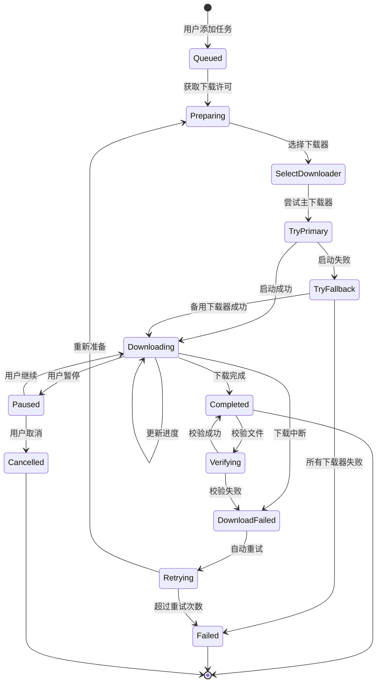

### 外部工具集成

**N_m3u8DL-RE 调用示例：**

```rust
use tokio::process::Command;
use tokio::io::{AsyncBufReadExt, BufReader};

// 下载器包装器
struct DownloaderWrapper {
    downloader_type: DownloaderType,
    binary_path: PathBuf,
}

impl DownloaderWrapper {
    async fn download(
        &self,
        url: &str,
        save_path: &Path,
        tx: mpsc::Sender<DownloadProgress>,
    ) -> Result<()> {
        match self.downloader_type {
            DownloaderType::NM3u8DLRE => {
                self.download_with_nm3u8dl(url, save_path, tx).await
            }
            DownloaderType::FFmpeg => {
                self.download_with_ffmpeg(url, save_path, tx).await
            }
        }
    }
    
    async fn download_with_nm3u8dl(
        &self,
        url: &str,
        save_path: &Path,
        tx: mpsc::Sender<DownloadProgress>,
    ) -> Result<()> {
        let mut child = Command::new(&self.binary_path)
            .arg(url)
            .arg("--save-dir")
            .arg(save_path)
            .arg("--thread-count")
            .arg("8")
            .arg("--download-retry-count")
            .arg("3")
            .stdout(Stdio::piped())
            .stderr(Stdio::piped())
            .spawn()?;
        
        // 读取标准输出
        let stdout = child.stdout.take().unwrap();
        let mut reader = BufReader::new(stdout).lines();
        
        // 解析进度日志
        while let Some(line) = reader.next_line().await? {
            if let Some(progress) = self.parse_progress(&line) {
                tx.send(progress).await?;
            }
        }
        
        // 等待进程结束
        let status = child.wait().await?;
        
        if status.success() {
            Ok(())
        } else {
            Err(Error::DownloadFailed)
        }
    }
    
    fn parse_progress(&self, line: &str) -> Option<DownloadProgress> {
        // 解析日志行,提取进度信息
        // 示例日志: "Downloaded: 1.2GB / 2.4GB (50%) @ 5.2MB/s"
        
        // 使用正则表达式提取
        lazy_static! {
            static ref PROGRESS_RE: Regex = Regex::new(
                r"(\d+\.?\d*)\s*([KMGT]?B)\s*/\s*(\d+\.?\d*)\s*([KMGT]?B)\s*\((\d+)%\)\s*@\s*(\d+\.?\d*)\s*([KMGT]?B/s)"
            ).unwrap();
        }
        
        if let Some(caps) = PROGRESS_RE.captures(line) {
            Some(DownloadProgress {
                downloaded: parse_size(&caps[1], &caps[2]),
                total: parse_size(&caps[3], &caps[4]),
                progress: caps[5].parse().ok()?,
                speed: parse_size(&caps[6], &caps[7]),
            })
        } else {
            None
        }
    }
}
```

### 自动版本检测

```rust
// 下载器版本管理
struct DownloaderVersionManager {
    github_api_client: GithubClient,
    update_channel: UpdateChannel, // Stable / Beta
}

impl DownloaderVersionManager {
    async fn check_for_updates(&self) -> Result<Option<UpdateInfo>> {
        // 1. 获取当前版本
        let current_version = self.get_current_version().await?;
        
        // 2. 从 GitHub API 获取最新版本
        let latest_release = self.github_api_client
            .get_latest_release("nilaoda/N_m3u8DL-RE")
            .await?;
        
        // 3. 比较版本
        if Version::parse(&latest_release.tag_name)? > current_version {
            Ok(Some(UpdateInfo {
                current: current_version.to_string(),
                latest: latest_release.tag_name,
                download_url: self.get_download_url(&latest_release)?,
                changelog: latest_release.body,
            }))
        } else {
            Ok(None)
        }
    }
    
    async fn auto_update(&self, update_info: &UpdateInfo) -> Result<()> {
        // 1. 下载新版本
        let temp_path = self.download_update(update_info).await?;
        
        // 2. 验证校验和
        self.verify_checksum(&temp_path, &update_info.checksum).await?;
        
        // 3. 备份当前版本
        let backup_path = self.backup_current_binary()?;
        
        // 4. 替换二进制文件
        match self.replace_binary(&temp_path).await {
            Ok(_) => {
                // 成功,删除备份
                fs::remove_file(backup_path)?;
                Ok(())
            }
            Err(e) => {
                // 失败,恢复备份
                self.restore_backup(&backup_path)?;
                Err(e)
            }
        }
    }
}
```

---

## 开发路线图

### 第一阶段：基础架构 (2-3 周)

**目标：** 搭建项目骨架,实现基本功能

**任务清单：**

|任务|优先级|预计时间|交付物|
|---|---|---|---|
|Tauri 项目初始化|🔴 高|1 天|可运行的空项目|
|Vue 3 前端架构搭建|🔴 高|2 天|侧边导航 + 路由|
|SQLite 数据库设计|🔴 高|2 天|表结构 + 迁移脚本|
|文件扫描模块|🔴 高|3 天|基本扫描功能|
|正则番号识别|🟡 中|2 天|常见格式识别|
|基本 UI 组件集成|🟡 中|2 天|Shadcn/ui 组件库|

**里程碑：** 能够扫描本地文件夹并通过正则识别番号

### 第二阶段：AI 增强 (2-3 周)

**目标：** 集成 AI 识别能力

**任务清单：**

|任务|优先级|预计时间|交付物|
|---|---|---|---|
|AI API 客户端封装|🔴 高|2 天|支持 OpenAI/DeepSeek|
|Prompt 工程优化|🔴 高|3 天|高准确率的 Prompt|
|多模型容错机制|🟡 中|2 天|自动切换逻辑|
|AI 缓存层|🟡 中|1 天|Moka 缓存集成|
|视觉识别 (VLM)|🟢 低|3 天|截图 + GPT-4V|
|AI 配置界面|🟡 中|2 天|多提供商管理|

**里程碑：** AI 识别准确率 > 90%

### 第三阶段：刮削引擎 (3-4 周)

**目标：** 实现多源数据抓取

**任务清单：**

|任务|优先级|预计时间|交付物|
|---|---|---|---|
|声明式解析器框架|🔴 高|3 天|JSON 配置驱动|
|JavBus 刮削器|🔴 高|2 天|完整元数据抓取|
|JavDB 刮削器|🟡 中|2 天|备用数据源|
|图像下载流水线|🔴 高|3 天|下载 + WebP 转换|
|BlurHash 生成|🟡 中|1 天|占位符优化|
|Cloudflare 挑战处理|🔴 高|3 天|隐藏窗口验证|
|刮削任务队列|🟡 中|2 天|并发控制|

**里程碑：** 能够自动刮削并保存完整元数据

### 第四阶段：性能优化 (2 周)

**目标：** 确保流畅体验

**任务清单：**

|任务|优先级|预计时间|交付物|
|---|---|---|---|
|虚拟滚动实现|🔴 高|3 天|@tanstack/vue-virtual|
|图片懒加载|🔴 高|1 天|IntersectionObserver|
|数据库索引优化|🟡 中|1 天|查询性能 < 100ms|
|缓存策略完善|🟡 中|2 天|三级缓存|
|性能基准测试|🟡 中|2 天|达标测试报告|
|内存占用优化|🟢 低|2 天|< 500MB (10k 视频)|

**里程碑：** 性能指标全部达标

### 第五阶段：下载功能 (2-3 周)

**目标：** 集成下载器

**任务清单：**

|任务|优先级|预计时间|交付物|
|---|---|---|---|
|外部工具管理|🔴 高|2 天|Sidecar 集成|
|N_m3u8DL-RE 封装|🔴 高|3 天|进度解析|
|下载队列管理|🔴 高|2 天|并发控制|
|进度实时推送|🔴 高|1 天|Tauri Event|
|自动版本检测|🟢 低|2 天|GitHub API|
|下载界面完善|🟡 中|2 天|表格 + 操作菜单|

**里程碑：** 稳定的多线程下载功能

### 第六阶段：高级功能 (2-3 周)

**目标：** 提升用户体验

**任务清单：**

|任务|优先级|预计时间|交付物|
|---|---|---|---|
|文件热监控|🟡 中|2 天|notify 库集成|
|外部播放器调用|🟡 中|1 天|PotPlayer/VLC|
|NFO 文件生成|🟢 低|2 天|Kodi/Emby 兼容|
|批量重命名|🟢 低|1 天|模板化重命名|
|标签管理系统|🟡 中|2 天|自定义标签|
|高级过滤排序|🟡 中|2 天|多维度筛选|
|导入导出功能|🟢 低|1 天|JSON/CSV|

**里程碑：** 功能完备的媒体管理系统

### 第七阶段：测试与发布 (1-2 周)

**目标：** 稳定性验证和打包

**任务清单：**

|任务|优先级|预计时间|交付物|
|---|---|---|---|
|单元测试覆盖|🔴 高|3 天|> 70% 覆盖率|
|集成测试|🔴 高|2 天|核心流程测试|
|性能压力测试|🟡 中|1 天|10k+ 视频测试|
|跨平台测试|🔴 高|2 天|Win/Mac/Linux|
|安装包构建|🔴 高|1 天|MSI/DMG/AppImage|
|文档完善|🟡 中|2 天|用户手册|
|Beta 测试|🟡 中|1 周|Bug 收集与修复|

**里程碑：** 发布 v1.0.0 正式版

---

## 项目目录结构

```
JAVManager/
├── src-tauri/                  # Rust 后端
│   ├── src/
│   │   ├── main.rs            # 入口文件
│   │   ├── commands/          # Tauri Commands
│   │   │   ├── scanner.rs
│   │   │   ├── ai.rs
│   │   │   ├── scraper.rs
│   │   │   ├── downloader.rs
│   │   │   └── settings.rs
│   │   ├── core/              # 核心业务逻辑
│   │   │   ├── scanner/
│   │   │   │   ├── mod.rs
│   │   │   │   ├── file_scanner.rs
│   │   │   │   └── file_monitor.rs
│   │   │   ├── ai/
│   │   │   │   ├── mod.rs
│   │   │   │   ├── router.rs
│   │   │   │   ├── text_identifier.rs
│   │   │   │   └── vision_identifier.rs
│   │   │   ├── scraper/
│   │   │   │   ├── mod.rs
│   │   │   │   ├── config_loader.rs
│   │   │   │   ├── html_parser.rs
│   │   │   │   └── metadata_extractor.rs
│   │   │   ├── downloader/
│   │   │   │   ├── mod.rs
│   │   │   │   ├── manager.rs
│   │   │   │   └── nm3u8dl.rs
│   │   │   └── image/
│   │   │       ├── mod.rs
│   │   │       ├── downloader.rs
│   │   │       ├── converter.rs
│   │   │       └── blurhash.rs
│   │   ├── database/          # 数据库层
│   │   │   ├── mod.rs
│   │   │   ├── models.rs
│   │   │   ├── migrations.rs
│   │   │   └── queries.rs
│   │   ├── utils/             # 工具函数
│   │   │   ├── cache.rs
│   │   │   ├── rate_limiter.rs
│   │   │   └── regex_patterns.rs
│   │   └── config/            # 配置管理
│   │       ├── mod.rs
│   │       └── settings.rs
│   ├── bin/                   # 外部工具
│   │   ├── ffmpeg.exe
│   │   └── N_m3u8DL-RE.exe
│   ├── resources/             # 资源文件
│   │   └── scrapers/
│   │       ├── javbus.json
│   │       ├── javdb.json
│   │       └── javlibrary.json
│   ├── migrations/            # 数据库迁移
│   │   └── 001_initial.sql
│   ├── Cargo.toml
│   └── tauri.conf.json
│
├── src/                       # Vue 前端
│   ├── assets/               # 静态资源
│   ├── components/           # 公共组件
│   │   ├── ui/              # Shadcn UI 组件
│   │   ├── VideoCard.vue
│   │   ├── DownloadTable.vue
│   │   └── ScrapeTable.vue
│   ├── views/               # 页面视图
│   │   ├── MediaLibrary.vue
│   │   ├── DownloadView.vue
│   │   ├── ScrapeView.vue
│   │   └── SettingsView.vue
│   ├── stores/              # Pinia 状态管理
│   │   ├── video.ts
│   │   ├── download.ts
│   │   ├── scrape.ts
│   │   └── settings.ts
│   ├── composables/         # 组合式函数
│   │   ├── useVirtualScroll.ts
│   │   ├── useTauriEvents.ts
│   │   └── useContextMenu.ts
│   ├── types/               # TypeScript 类型
│   │   ├── video.ts
│   │   ├── download.ts
│   │   └── api.ts
│   ├── utils/               # 工具函数
│   │   ├── format.ts
│   │   └── constants.ts
│   ├── App.vue
│   ├── main.ts
│   └── router.ts
│
├── docs/                     # 文档
│   ├── API.md
│   ├── ARCHITECTURE.md
│   └── USER_GUIDE.md
│
├── tests/                    # 测试
│   ├── unit/
│   └── integration/
│
├── package.json
├── tsconfig.json
├── tailwind.config.js
└── README.md
```

---

## 技术要点总结

### Rust 后端关键技术

1. **异步编程**
    
    - 使用 Tokio 运行时
    - async/await 语法
    - 信号量控制并发
2. **数据库操作**
    
    - SQLx 的编译时 SQL 检查
    - 事务处理
    - 连接池管理
3. **HTTP 请求**
    
    - Reqwest 客户端
    - 代理配置
    - Cookie 管理
4. **文件处理**
    
    - 异步文件 I/O
    - 流式读取
    - 路径规范化
5. **进程管理**
    
    - tokio::process::Command
    - 标准输出捕获
    - 信号处理

### Vue 前端关键技术

1. **性能优化**
    
    - 虚拟滚动
    - 懒加载
    - 防抖节流
2. **状态管理**
    
    - Pinia Store
    - 持久化
    - 响应式更新
3. **组件通信**
    
    - Props/Emit
    - Provide/Inject
    - Event Bus (Tauri)
4. **样式方案**
    
    - TailwindCSS 原子类
    - CSS Modules
    - 深色模式切换
5. **TypeScript**
    
    - 类型定义
    - 接口声明
    - 泛型使用

### Tauri 集成关键技术

1. **IPC 通信**
    
    - Command 调用
    - Event 推送
    - 双向通信
2. **系统集成**
    
    - 文件系统访问
    - Shell 命令执行
    - 系统对话框
3. **权限管理**
    
    - capabilities 配置
    - 资源访问控制
    - 安全策略
4. **窗口管理**
    
    - 主窗口
    - 隐藏窗口(验证)
    - 多窗口通信

---

## 性能监控与优化

### 关键性能指标 (KPI)

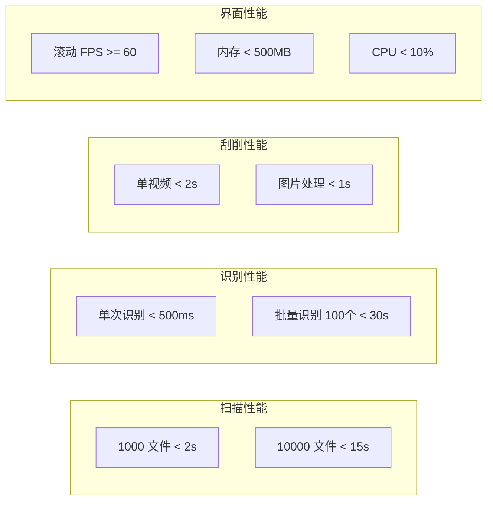

### 性能监控工具

```rust
// 性能监控器
struct PerformanceMonitor {
    metrics: Arc<RwLock<HashMap<String, Metric>>>,
}

#[derive(Debug)]
struct Metric {
    name: String,
    count: u64,
    total_duration: Duration,
    avg_duration: Duration,
    min_duration: Duration,
    max_duration: Duration,
}

impl PerformanceMonitor {
    async fn measure<F, T>(&self, name: &str, f: F) -> T
    where
        F: Future<Output = T>,
    {
        let start = Instant::now();
        let result = f.await;
        let duration = start.elapsed();
        
        self.record(name, duration).await;
        result
    }
    
    async fn record(&self, name: &str, duration: Duration) {
        let mut metrics = self.metrics.write().await;
        let metric = metrics.entry(name.to_string()).or_insert(Metric::new(name));
        
        metric.count += 1;
        metric.total_duration += duration;
        metric.avg_duration = metric.total_duration / metric.count as u32;
        metric.min_duration = metric.min_duration.min(duration);
        metric.max_duration = metric.max_duration.max(duration);
    }
    
    async fn report(&self) -> String {
        let metrics = self.metrics.read().await;
        let mut report = String::from("=== Performance Report ===\n");
        
        for (name, metric) in metrics.iter() {
            report.push_str(&format!(
                "{}: count={}, avg={:?}, min={:?}, max={:?}\n",
                name, metric.count, metric.avg_duration,
                metric.min_duration, metric.max_duration
            ));
        }
        
        report
    }
}

// 使用示例
#[tauri::command]
async fn scan_directory(
    path: String,
    monitor: State<'_, PerformanceMonitor>,
) -> Result<ScanResult> {
    monitor.measure("scan_directory", async {
        // 扫描逻辑
        perform_scan(&path).await
    }).await
}
```

---

## 安全性考虑

### 1. API 密钥保护

```rust
// 使用系统密钥环存储 API Key
use keyring::Entry;

struct SecureStorage {
    service_name: String,
}

impl SecureStorage {
    fn save_api_key(&self, provider: &str, api_key: &str) -> Result<()> {
        let entry = Entry::new(&self.service_name, provider)?;
        entry.set_password(api_key)?;
        Ok(())
    }
    
    fn get_api_key(&self, provider: &str) -> Result<String> {
        let entry = Entry::new(&self.service_name, provider)?;
        Ok(entry.get_password()?)
    }
}
```

### 2. 文件路径验证

```rust
// 防止路径遍历攻击
fn validate_path(path: &Path, base_dir: &Path) -> Result<PathBuf> {
    let canonical = path.canonicalize()?;
    
    if !canonical.starts_with(base_dir) {
        return Err(Error::InvalidPath);
    }
    
    Ok(canonical)
}
```

### 3. SQL 注入防护

```rust
// 使用参数化查询
sqlx::query!(
    "SELECT * FROM videos WHERE designation = ?",
    designation
)
.fetch_one(&pool)
.await?;

// ❌ 永远不要拼接 SQL
// let sql = format!("SELECT * FROM videos WHERE designation = '{}'", designation);
```

---

## 部署与打包

### Windows 打包配置

```json
{
  "bundle": {
    "active": true,
    "targets": ["msi", "nsis"],
    "identifier": "com.javmanager.app",
    "icon": ["icons/icon.ico"],
    "windows": {
      "certificateThumbprint": null,
      "digestAlgorithm": "sha256",
      "timestampUrl": "",
      "wix": {
        "language": ["zh-CN", "en-US"]
      }
    },
    "externalBin": [
      "bin/ffmpeg",
      "bin/N_m3u8DL-RE"
    ],
    "resources": [
      "resources/*"
    ]
  }
}
```

### 构建流程

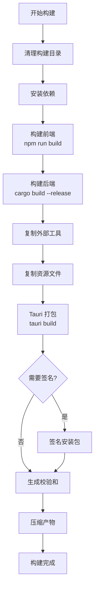

---

## 附录

### A. 常用命令速查

**开发环境启动：**

```bash
# 启动开发服务器
npm run tauri dev

# 热重载前端
npm run dev

# 检查 Rust 代码
cargo check
cargo clippy

# 运行测试
cargo test
npm run test
```

**构建命令：**

```bash
# 构建生产版本
npm run tauri build

# 仅构建前端
npm run build

# 仅构建后端
cargo build --release
```

**数据库操作：**

```bash
# 创建迁移
sqlx migrate add <name>

# 运行迁移
sqlx migrate run

# 回滚迁移
sqlx migrate revert
```

### B. 参考资源

**官方文档：**

- [Tauri 文档](https://tauri.app/zh-cn/)
- [Vue 3 文档](https://cn.vuejs.org/)
- [Shadcn/ui](https://ui.shadcn.com/)
- [TailwindCSS](https://tailwindcss.com/)
- [SQLx](https://github.com/launchbadge/sqlx)

**技术博客：**

- [Tokio 异步编程](https://tokio.rs/tokio/tutorial)
- [Rust 性能优化](https://nnethercote.github.io/perf-book/)
- [Vue 性能优化](https://vuejs.org/guide/best-practices/performance.html)

**社区资源：**

- [Tauri Discord](https://discord.com/invite/tauri)
- [Rust 中文社区](https://rustcc.cn/)
- [Vue 中文社区](https://cn.vuejs.org/community/)

### C. 常见问题 (FAQ)

**Q: 如何处理大文件扫描导致的内存溢出？** A: 使用流式处理，配合信号量限制并发数，避免一次性加载所有文件到内存。

**Q: AI 识别失败率较高怎么办？** A: 优化 Prompt，增加 few-shot 示例，配置多个备用模型，降低置信度阈值。

**Q: 虚拟滚动卡顿怎么优化？** A: 增加 overscan 数量，使用 will-change CSS 属性，减少重渲染，启用硬件加速。

**Q: 如何避免触发反爬虫？** A: 增加请求延迟，使用代理池轮换，模拟浏览器请求头，处理 Cloudflare 挑战。

**Q: 数据库查询慢怎么办？** A: 添加索引，使用 EXPLAIN 分析查询计划，开启 WAL 模式，增加缓存大小。

---

## 结语

本开发文档提供了 JAVManager 项目的全面技术指南，涵盖了从架构设计到具体实现的各个方面。遵循本文档的设计原则和最佳实践，可以构建出一个高性能、现代化的视频媒体管理系统。

**关键成功因素：**

1. 严格遵循性能指标
2. 充分利用 Rust 的零成本抽象
3. 合理使用缓存和异步编程
4. 持续进行性能监控和优化
5. 保持代码的可维护性和可扩展性

祝开发顺利！🚀